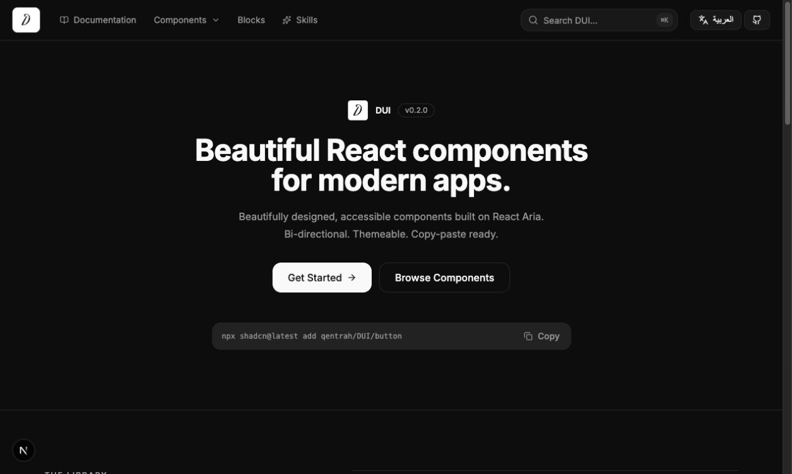

<p align="center">
  
</p>

<h1 align="center">DUI</h1>

<p align="center">
  An open-source React component library and shadcn registry.
</p>

DUI is the design system and [shadcn](https://ui.shadcn.com/) registry maintained by [qentrah](https://github.com/qentrah). Components are copied into your application as source code, so your team owns every line and can adapt the system without adding a runtime UI-library dependency.



## Why DUI?

- Distributed through the shadcn CLI
- Zinc-first design tokens with accessible dark surfaces
- TypeScript and Tailwind CSS
- Supports LTR and RTL layouts
- Components remain inside your application and under your control
- Open source under the MIT License

## Install

Initialize shadcn in an existing React project:

```bash
npx @qentrah/dui init
```

Add a DUI component using the npm shortcut:

```bash
npx @qentrah/dui add button
```

You can also use the shadcn CLI directly:

```bash
npx shadcn@latest add qentrah/DUI/button
```

You can install multiple items:

```bash
npx @qentrah/dui add button input card
```

Preview an installation without writing files:

```bash
npx @qentrah/dui add button --dry-run
```

Pin a release or commit for reproducible installations:

```bash
npx shadcn@latest add qentrah/DUI/button#v0.1.0
```

## Components

### Foundations

- `button`
- `input`
- `textarea`
- `checkbox`
- `switch`
- `badge`
- `card`
- `alert`
- `avatar`
- `progress`
- `separator`
- `skeleton`
- `spinner`

### Product primitives

- `filter-chip`
- `status-pill`
- `empty-state`
- `color-dot`
- `tag-chip`
- `legend-item`
- `list-row`
- `list-item`
- `color-swatch`
- `status-badge`
- `department-dot`

### Application components

- `video-player`
- `banner`
- `custom-banner`
- `code-viewer`
- `resizable`
- `composer`
- `ai-composer`
- `search-input`
- `menu`
- `dropdown`
- `sidebar`
- `mobile-nav`
- `modal`
- `popover`
- `chart`
- `table`
- `cursor`

### Motion plugins

- `css-motion`
- `gsap-motion`
- `motion-reveal`

### Blocks

- `blocks-sign-in`
- `blocks-sign-in-css`
- `blocks-sign-in-gsap`
- `blocks-session`
- `blocks-color-filter`
- `blocks-hero-simple`
- `blocks-hero-centered`
- `blocks-cta-section`
- `blocks-feature-grid`
- `blocks-gallery-mosaic`
- `blocks-photo-story`
- `blocks-testimonial-section`
- `blocks-testimonial-grid`
- `blocks-logo-cloud`
- `blocks-local-logo-wall`
- `blocks-faq-section`

Blocks install their declared DUI primitives automatically. Motion-enhanced variants are separate registry entries, so products can start with the normal block and opt into CSS or GSAP only when needed.

The source of truth is [`registry.json`](./registry.json). Built registry payloads are generated in [`public/r`](./public/r).

## Direction support

DUI components use logical layout utilities wherever direction matters. Set the document direction at the application boundary:

```tsx
<html dir="rtl">
  <body>{children}</body>
</html>
```

For left-to-right layouts:

```tsx
<html dir="ltr">
  <body>{children}</body>
</html>
```

## Local development

Requirements:

- Node.js 20 or newer
- npm 10 or newer

```bash
git clone https://github.com/qentrah/DUI.git
cd DUI
npm install
npm run dev
```

Open [http://localhost:3000](http://localhost:3000).

Before submitting a change:

```bash
npm run lint
npm run build
npm run registry:build
npm run registry:validate
```

## Registry structure

```text
app/                 Documentation website
components/ui/       Installable component source
components/library/  Documentation previews
lib/                 Shared utilities and catalogs
public/r/            Generated registry payloads
registry.json        Registry source of truth
components.json      Local shadcn configuration
```

When adding an installable component:

1. Add its source to `components/ui`.
2. Declare the item and dependencies in `registry.json`.
3. Add its documentation metadata to `lib/catalog.ts`.
4. Add a preview and example source.
5. Build and validate the registry.

## Contributing

Contributions are welcome. Read [`CONTRIBUTING.md`](./CONTRIBUTING.md) before opening a pull request. By participating, you agree to follow the [`CODE_OF_CONDUCT.md`](./CODE_OF_CONDUCT.md).

For security issues, follow the private reporting process in [`SECURITY.md`](./SECURITY.md).

## License

DUI is available under the [MIT License](./LICENSE).
